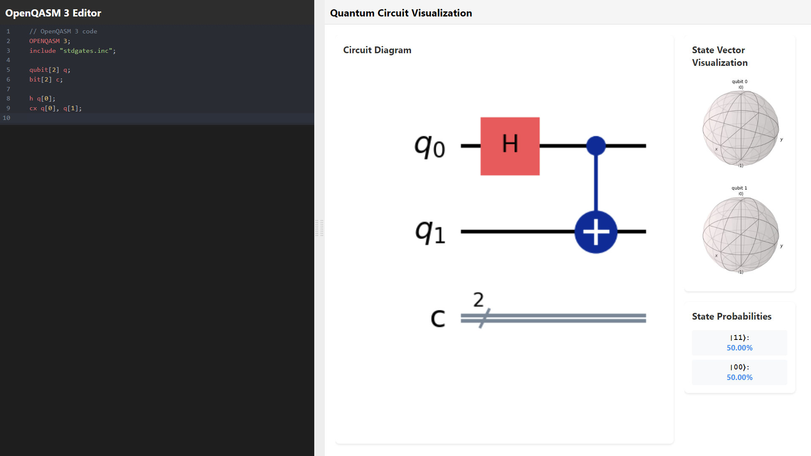
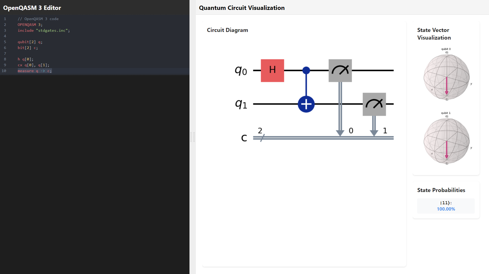

# Real-time QASM Visualiser

## Table of Contents

- [Overview](#overview)
- [Features](#features)
- [Technologies Used](#technologies-used)
- [Prerequisites](#prerequisites)
- [Installation](#installation)
  - [Frontend](#frontend)
  - [Backend](#backend)
- [Running the Application](#running-the-application)


## Overview

**Real-time QASM Visualiser** is a web application designed to visualize Quantum Assembly (openQASM) code in real-time. Leveraging a React frontend and a FastAPI backend, the application provides users with an intuitive interface to input openQASM code and instantly view corresponding quantum circuit diagrams, state vector visualizations, and probability distributions.




## Features

- **Real-time Visualization:** Instantly visualize quantum circuits as you write openQASM code.
- **State Vector Display:** View the state vector of your quantum circuit.
- **Probability Distribution:** Analyze the probability distribution of quantum states.
- **Syntax Highlighting & Linting:** Enhanced coding experience with syntax highlighting and real-time linting for openQASM code.
- **Responsive Design:** Optimized for various device sizes and screen resolutions.

## Technologies Used

- **Frontend:**
  - React
  - Material-UI (MUI)
  - CodeMirror
  - Emotion for styling
- **Backend:**
  - FastAPI
  - Qiskit
  - Uvicorn
- **Other Tools:**
  - GitHub Actions for CI/CD
  - PyPI for package deployment

## Prerequisites

Before setting up the project, ensure you have the following installed:

- **Node.js** (v14 or later)
- **Python 3.8+**
- **npm** (comes with Node.js)
- **pip** (comes with Python)
- **Git**

## Installation

### Frontend

1. **Navigate to the Directory:**

   ```bash
   cd Real_time_QASM_Visualiser
   ```

2. **Install Dependencies:**

   ```bash
   npm install
   ```

3. **Start the Development Server:**

   ```bash
   npm start
   ```

   The frontend will run on [http://localhost:3000](http://localhost:3000).

### Backend

1. **Navigate to the Backend Directory:**

   ```bash
   cd backend
   ```

2. **Create a Virtual Environment:**

   ```bash
   python -m venv venv
   ```

3. **Activate the Virtual Environment:**

   - **On Windows:**

     ```bash
     venv\Scripts\activate
     ```

   - **On macOS/Linux:**

     ```bash
     source venv/bin/activate
     ```

4. **Install Dependencies:**

   ```bash
   pip install -r requirements.txt
   ```

5. **Run the Backend Server:**

   ```bash
   uvicorn main:app --reload
   ```

   The backend will run on [http://localhost:8000](http://localhost:8000).

## Running the Application

1. **Start the Backend Server** (if not already running):

   ```bash
   cd backend
   source venv/bin/activate  # On macOS/Linux
   # venv\Scripts\activate  # On Windows
   uvicorn main:app --reload
   ```

2. **Start the Frontend Server:**

   ```bash
   cd ..
   npm start
   ```

3. **Access the Application:**

   Open your browser and navigate to [http://localhost:3000](http://localhost:3000) to use the Real-time QASM Visualiser.
   

